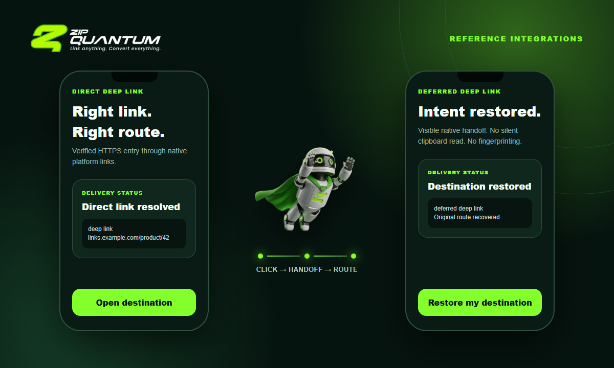

<p align="center">
  <a href="https://zq.tn/">
    <picture>
      <source media="(prefers-color-scheme: dark)" srcset="docs/assets/zipquantum-logo-dark-bg.png">
      <source media="(prefers-color-scheme: light)" srcset="docs/assets/zipquantum-logo-light-bg.png">
      
    </picture>
  </a>
</p>

<h1 align="center">Mobile deep-link examples</h1>

<p align="center">Auditable, agent-first reference integrations for direct and deferred deep links.</p>

<p align="center">
  <a href="https://github.com/ProxiwebLabs/zipquantum-mobile-examples/actions/workflows/validate.yml"></a>
  
  
  
</p>

<table>
  <tr>
    <td width="50%" align="center"></td>
    <td width="50%" align="center"></td>
  </tr>
  <tr>
    <td align="center"><b>One verified link</b><br>Universal Links and App Links open the intended route.</td>
    <td align="center"><b>Intent survives install</b><br>Native, explicit handoff restores the destination.</td>
  </tr>
</table>

<p align="center">
  
</p>

These examples use platform APIs directly:

- no proprietary ZipQuantum SDK;
- no fingerprinting or cross-app user identifier;
- signed, short-lived handoff receipts;
- explicit clipboard recovery on iOS;
- aggregate funnel acknowledgements only after the destination route opens.

## Examples

| Platform | Direct deep link | Deferred deep link | Route acknowledgement |
| --- | --- | --- | --- |
| [SwiftUI](ios-swiftui/) | Universal Links | `UIPasteControl` user action | Signed `route_ack` receipt |
| [Kotlin](android-kotlin/) | Verified App Links | Google Play Install Referrer | Signed `route_ack` receipt |
| [React Native](react-native/) | `Linking` + verified HTTPS links | Native `UIPasteControl` / Install Referrer adapters | Signed `route_ack` receipt |
| [Flutter](flutter/) | `app_links` + verified HTTPS links | Native `UIPasteControl` / Install Referrer adapters | Signed `route_ack` receipt |

The sample identifiers and hosts are placeholders. Replace them with values verified in your ZipQuantum dashboard before running an app.

## AI agents

Start with [AGENTS.md](AGENTS.md), then read the machine-readable [mobile contract](contracts/mobile-v1.schema.json), [AI manifest](ai-manifest.json), and [agent integration guide](docs/agent-integration.md). Every verification command is non-interactive, uses stable `ZQ_*` output prefixes, and returns a non-zero exit code on failure.

```sh
./scripts/validate.sh
```

## Contract

The apps call the public endpoints documented in [docs/mobile-contract.md](docs/mobile-contract.md). The server resolves routing and issues a host- and app-bound acknowledgement receipt. Apps never manufacture or decode this receipt.

## Security and privacy

See [SECURITY.md](SECURITY.md). Device context is optional and coarse. Do not add advertising identifiers, pasteboard reads at launch, device fingerprinting, or a locally generated substitute for a server receipt.

## License

MIT

<p align="center">
  <br>
  <a href="https://zq.tn/">Product</a> · <a href="https://zq.tn/docs/">Documentation</a> · <a href="https://zq.tn/developers/ai-agents/">AI agents</a>
</p>
